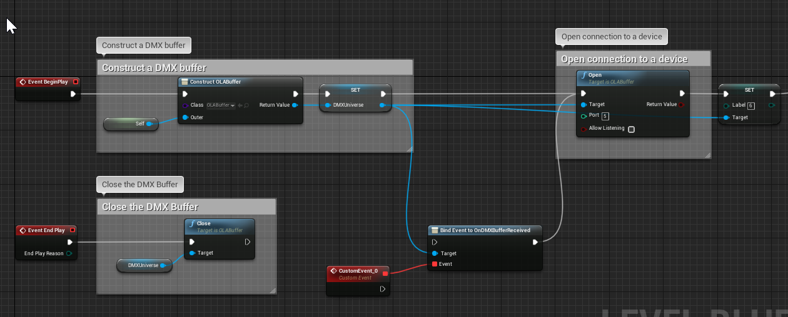
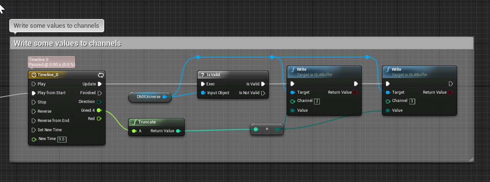

# UEOpenDMX
Implement DMX512 protocol so Unreal can send and receive DMX packages

# Technical Details

* Include C++ Source for C++ Projects.

# TODO

# Documentation

# Support
nicosanta@brightnightgames.net

# License
This is an open source project, you can use it freely. If you think this project useful, please give me a star to let me know it is useful, so I'll continue make it better.
